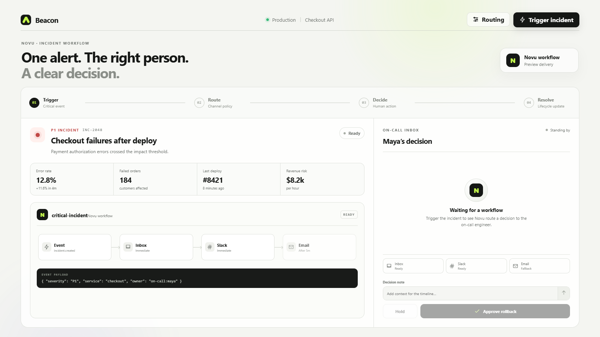
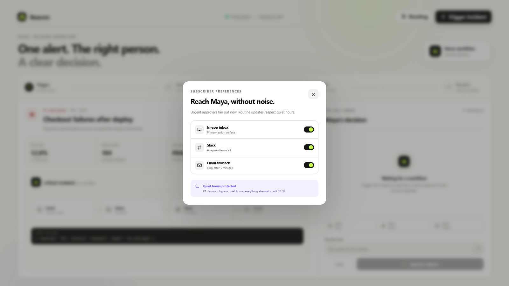
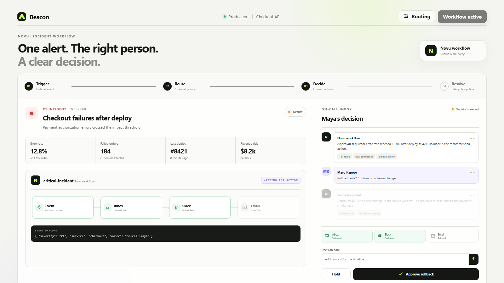
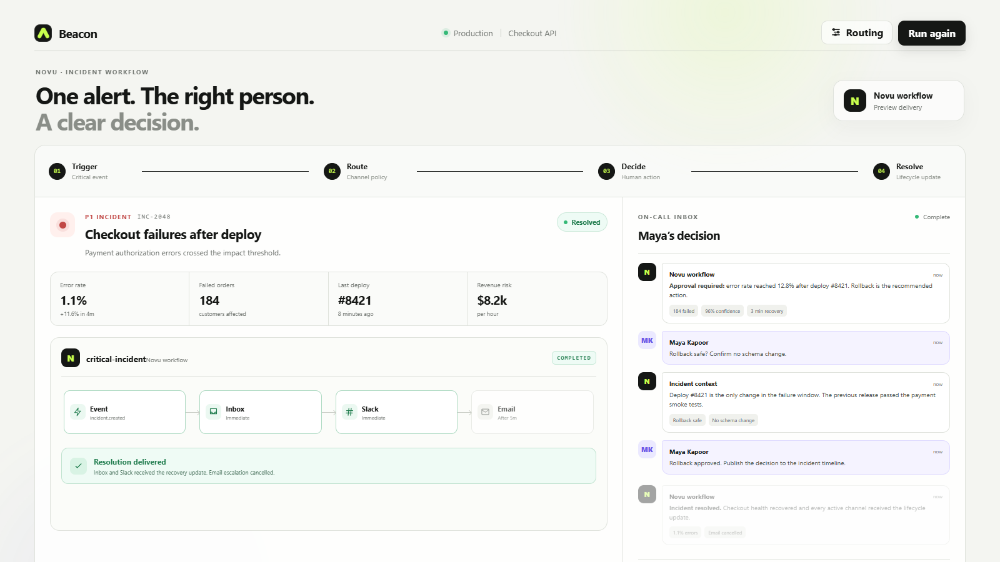

# Beacon

### One alert. The right person. A clear decision.

I built Beacon to show Novu as more than a notification sender. It is a small incident workflow where a critical event reaches the right person, gets a human decision, and closes the loop without creating more noise.

[Watch the 58 second product demo](videos/beacon-novu-workflow-demo.mp4) · [Run it locally](#run-it)

## Why I made this

During a P1 incident, sending another alert is easy. The difficult part is getting one clear decision from the right person and making sure every channel knows what happened next.

That is the idea behind Beacon.

The product sends intent to Novu and lets the workflow handle delivery. Inbox and Slack can arrive immediately, email can wait as a fallback, and the fallback can be cancelled as soon as the incident is approved.

## The workflow

**1. Trigger**

A checkout incident sends one structured event to Novu.

**2. Route**

The workflow reaches Maya through her active channels and respects her subscriber preferences.

**3. Decide**

Maya checks the impact, adds context, and approves the rollback from one focused screen.

**4. Resolve**

Beacon cancels the pending escalation and publishes the recovery update.

## What the product looks like

<table>
  <tr>
    <td width="50%">
      
       
      <strong>Routing without noise</strong>
       
      Immediate channels, delayed fallback, and quiet-hour behavior stay in the Novu workflow.
    </td>
    <td width="50%">
      
       
      <strong>A real human decision</strong>
       
      The notification carries impact, context, channel receipts, and the action that needs approval.
    </td>
  </tr>
</table>

## Where Novu helps

I did not want to hard-code separate Inbox, Slack, and email calls into the product. Beacon emits a lifecycle event once and Novu owns who receives it, when it arrives, and which channel should be used.

~~~js
await novu.trigger({
  workflowId: 'critical-incident',
  to: [{ subscriberId: 'on-call:maya' }],
  payload: {
    incidentId: 'INC-2048',
    severity: 'P1',
    service: 'Checkout API',
    recommendation: 'Roll back deploy #8421'
  }
});
~~~

Beacon keeps the transaction ID returned by the first trigger. When Maya approves the rollback, the backend uses that ID to cancel any pending delayed notification before sending the resolution event.

That small detail is important to me: a resolved incident should not produce a stale escalation five minutes later.

## Run it

~~~bash
git clone https://github.com/kh-bikash/novuagent.git
cd novuagent
npm install
npm start
~~~

Open [http://127.0.0.1:4173](http://127.0.0.1:4173) and click **Trigger incident**.

The complete product works in preview mode without credentials. To connect a real Novu environment, copy the values from **.env.example** and add your secret key, subscriber ID, and workflow identifiers.

~~~bash
npm run check
npm run demo:record
~~~

The demo recorder uses the real localhost product, real browser clicks, visible typing, focus zooms, and captions. There is no narration or generated product footage.

## Built with

- Novu's official TypeScript SDK
- Node.js
- Plain HTML, CSS, and JavaScript
- Puppeteer and FFmpeg for the reproducible product demo

Beacon is open source under the MIT license.
