# Relay — AI Incident Concierge

<div align="center">

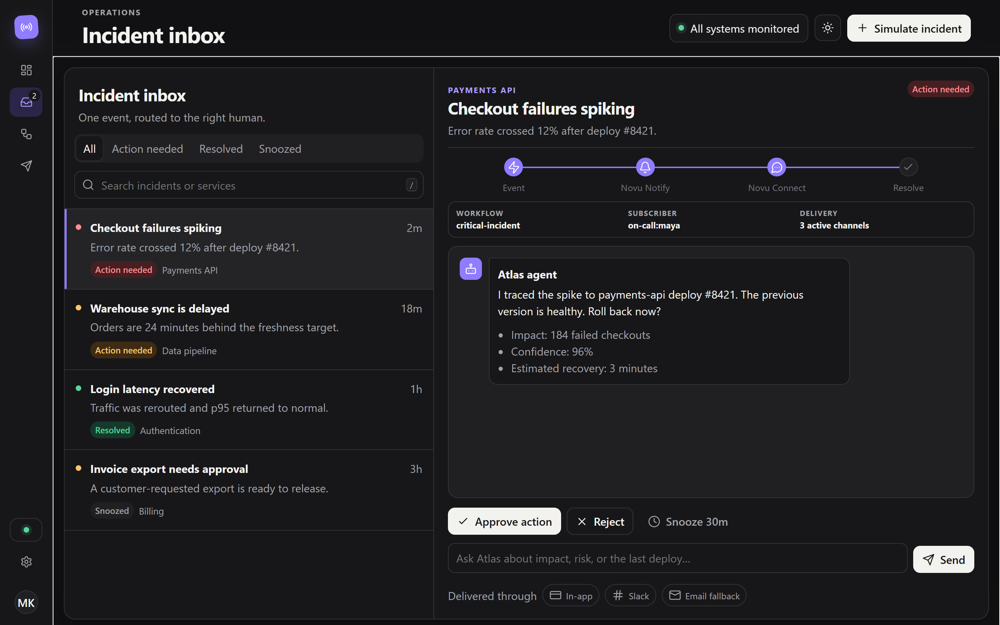

<br/>

[](https://novu.co)
[](https://nodejs.org)
[](http://127.0.0.1:4173)
[](Dockerfile)
[](LICENSE)

<p align="center">
  <strong>One incident event triggers multi-channel notification routing, contextual AI diagnostics, human-in-the-loop approval, and real-time state synchronization across every subscriber channel.</strong>
</p>

[Quickstart](#-quickstart) • [Architecture](#-system-architecture) • [Product Tour](#-product-tour--visual-walkthrough) • [Novu Integration](#-novu-integration--sdk-bridge) • [API Reference](#-api-reference) • [Deployment](#-deployment)

</div>

---

## 📖 Overview

**Relay** is an incident-concierge platform demonstrating the power of **[Novu](https://novu.co)** as a modern communication backbone for AI agents and operations teams. 

When mission-critical systems fail, alerts are often fragmented across disparate chat channels, inbox notifications, and dashboards. Relay demonstrates an integrated paradigm:
1. **Novu Notify** routes a single event across In-App Inbox, Slack, Email fallbacks, and SMS based on subscriber rules.
2. **Novu Connect** maintains a continuous, two-way conversational thread with **Atlas**, an on-call AI agent that correlates alerts, evaluates change history, and proposes verified mitigations.
3. **Human-in-the-Loop Governance** ensures high-risk remediation actions are never executed autonomously without authorized human sign-off.
4. **Live Channel Synchronization** updates the message state in place across every connected subscriber channel once an action is approved or rejected.

> [!NOTE]
> Relay is an original open-source application and reference implementation demonstrating how modern engineering teams can build custom AI agent experiences powered by Novu's communication infrastructure.

---

## 🎬 Demo Video

The repository includes a 60fps, high-fidelity recording demonstrating the end-to-end incident lifecycle from event trigger to AI investigation and multi-channel resolution:

🎥 **[Watch the full Relay workflow recording](videos/relay-real-workflow-demo.mp4)**

*(To re-record or update the demo video using Puppeteer DOM automation, run `npm run demo:record`)*

---

## 🏗️ System Architecture

Relay is architected with a decoupled frontend interface, a lightweight Node.js event bridge, and Novu's notification and workflow engine.

### High-Level End-to-End Architecture

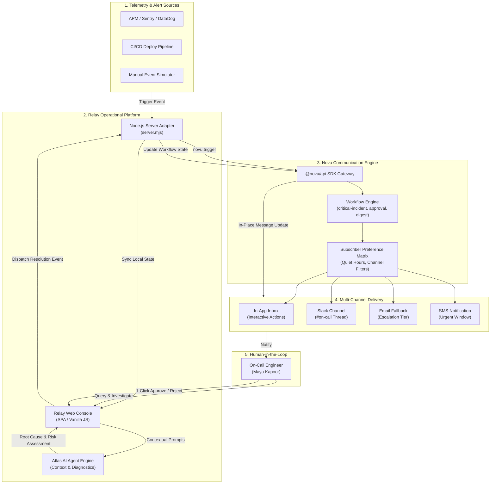

### Incident Lifecycle & Decision State Machine

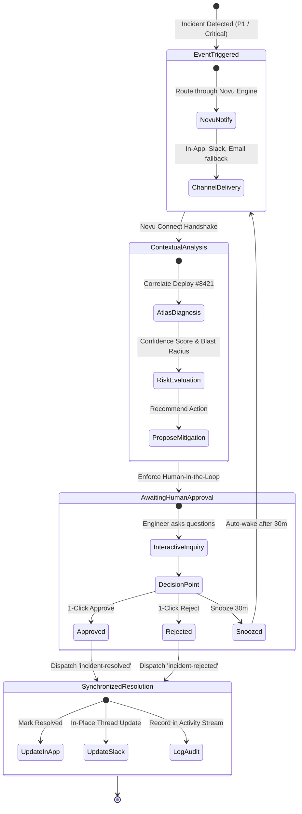

### Dual-Mode Runtime Architecture

Relay operates seamlessly in two modes without requiring any code modifications:

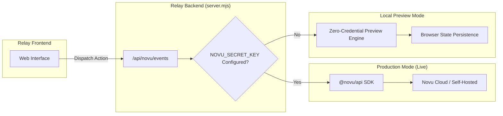

---

## 📸 Product Tour & Visual Walkthrough

### 1. Operations Command Center

The **Command Center** provides real-time situational awareness across all active operational incidents, acknowledgment metrics, auto-resolution rates, and recent workflow activity.

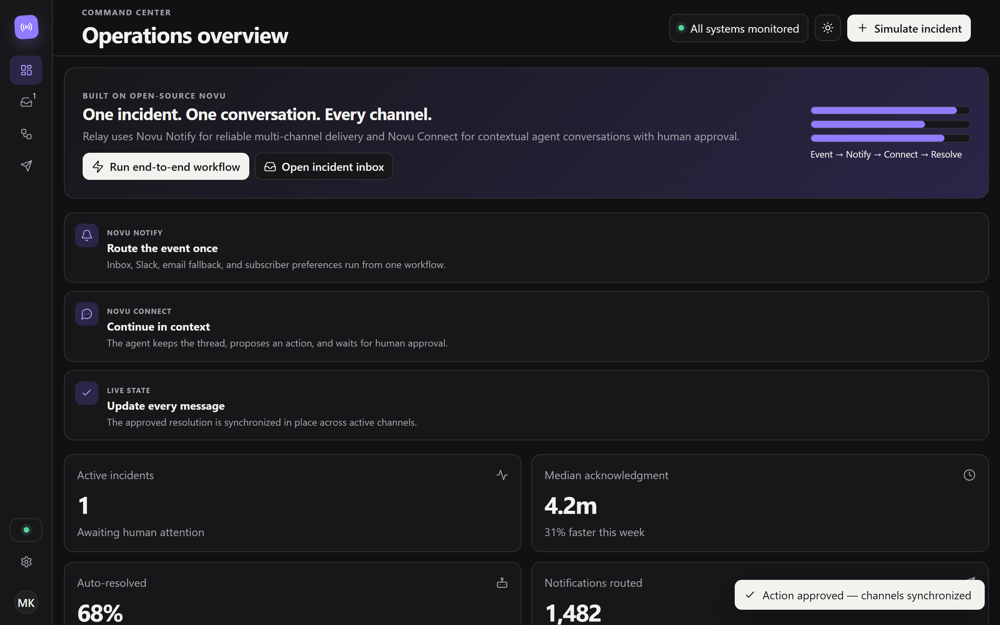

- **Real-Time Signal Health**: Live telemetry bars tracking end-to-end event flow (`Event` → `Notify` → `Connect` → `Resolve`).
- **Telemetry Cards**: Active incident counts, median acknowledgment time ($4.2\text{m}$), automated recovery percentage ($68\%$), and cumulative notifications routed.
- **Resolution Posture**: Verification that human approval policies and multi-channel fallbacks are active.

---

### 2. Incident Inbox & Triage Console

The **Incident Inbox** organizes incoming alerts with faceted filtering (`All`, `Action Needed`, `Resolved`, `Snoozed`), instant keyboard search (`/`), and multi-stage workflow tracking.

| Dark Theme (Default) | Light Theme |
| :---: | :---: |
|  | 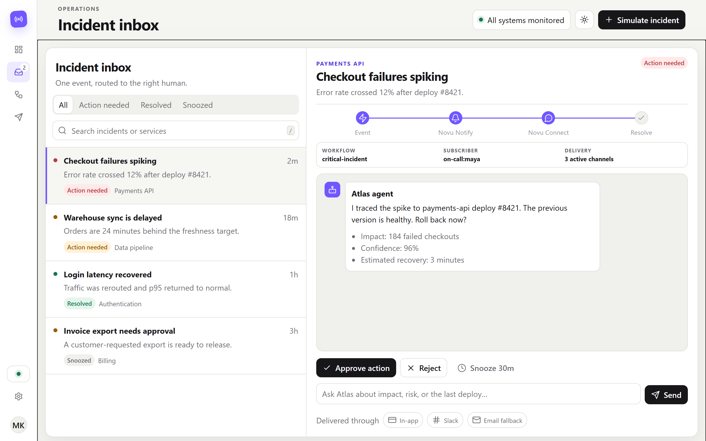 |

- **Novu Trace HUD**: Inspect the active workflow ID (`critical-incident`), target subscriber (`on-call:maya`), delivery fanout count, and live connection status.
- **Visual Progress Stepper**: 4-stage execution tracker displaying current position in the communication pipeline.

---

### 3. Atlas AI Agent & Contextual Diagnostics

Unlike static alert dashboards, Relay features **Atlas**, an AI incident concierge that correlates alerts against telemetry, recent code deployments, and SLO thresholds.

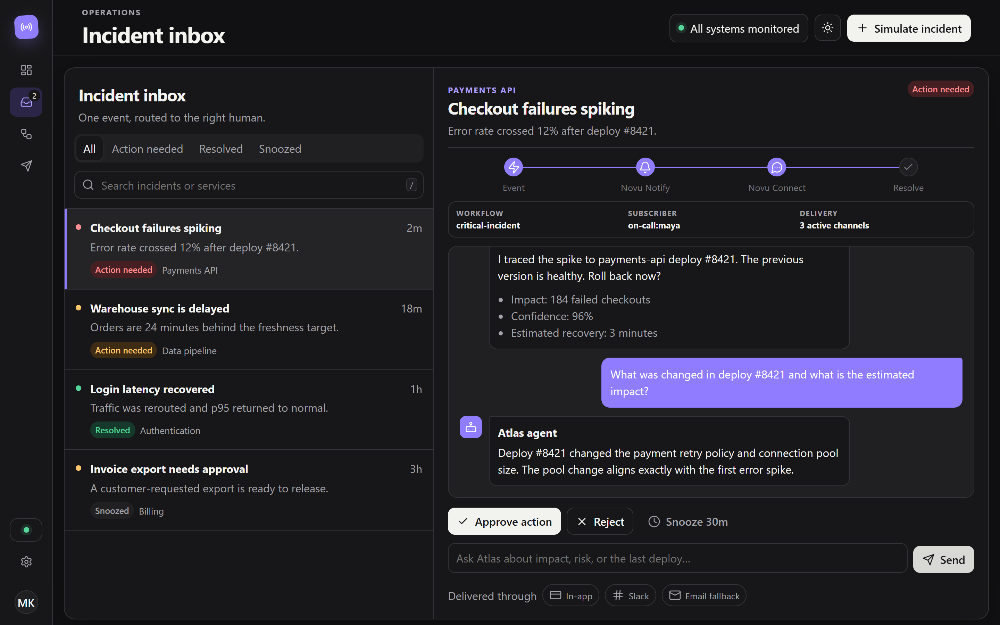

- **Root-Cause Tracing**: Atlas correlates anomalous spikes directly to deployment commits (e.g. *Deploy #8421 connection pool changes*).
- **Impact & Confidence Telemetry**: Calculates exact blast radius (e.g., *184 failed checkouts, 96% confidence, 3m recovery*).
- **Interactive Q&A Thread**: On-call engineers can ask freeform questions regarding rollback safety, blast radius, or recent changes.

---

### 4. Human Approval & Synchronized Resolution

Relay enforces strict human-in-the-loop safety. Remediations proposed by AI require explicit human sign-off before being executed. Once approved, the resolution is synchronized in place across all active channels.

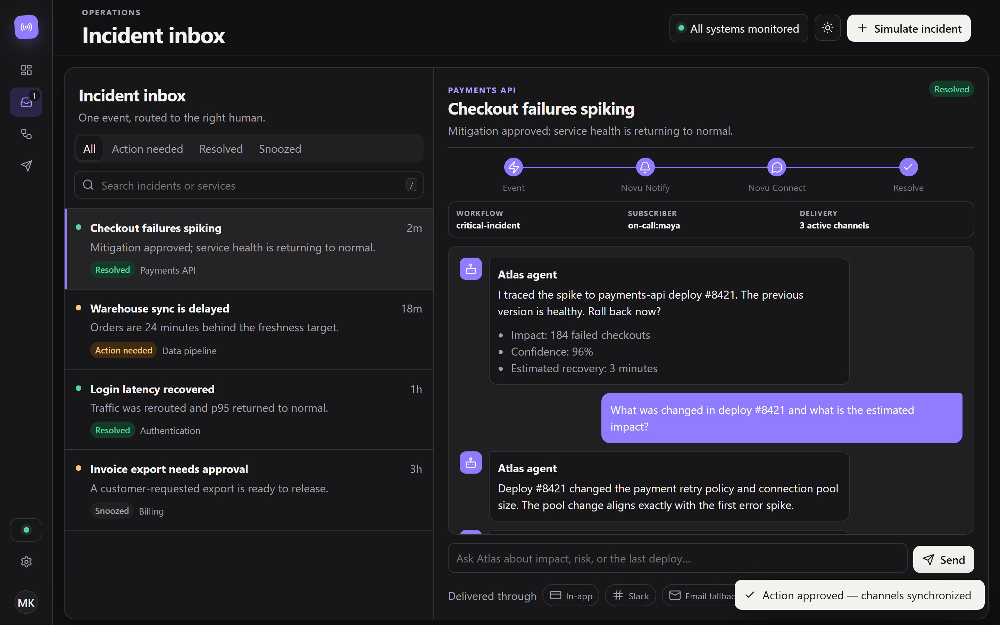

- **One-Click Action Row**: Fast-action triggers to **Approve action**, **Reject**, or **Snooze 30m**.
- **In-Place Multi-Channel Sync**: In-app inbox cards, Slack threads, and email notifications update their state to *Resolved* simultaneously.
- **Audit Logging**: Captures operator identity, timestamp, and decision outcomes for post-mortem analysis.

---

### 5. Novu Workflow Orchestration

Inspect and test workflow definitions directly from Relay's workflow management dashboard.

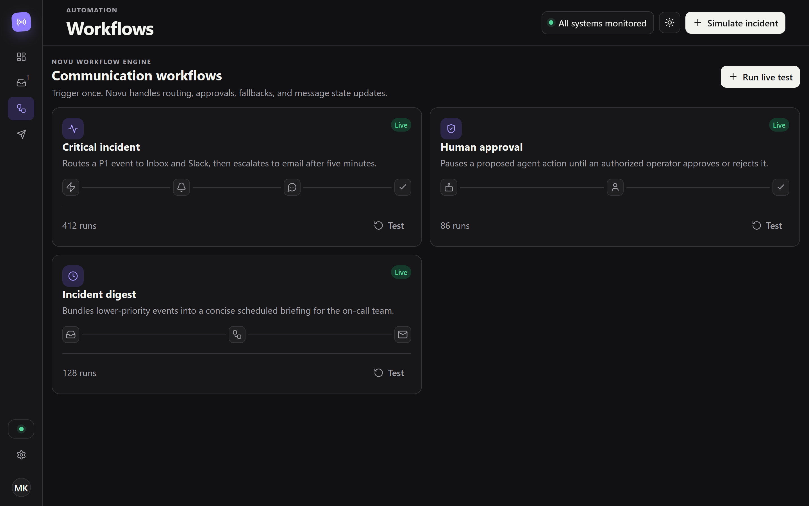

- **Critical Incident Workflow**: Immediate fanout to In-App and Slack, with 5-minute escalation to Email.
- **Human Approval Workflow**: Pauses agent mitigation execution pending authorized operator authorization.
- **Incident Digest Workflow**: Batches non-critical alerts into scheduled briefings for the on-call shift.

---

### 6. Subscriber Preferences & Channel Routing

Subscribers have full control over where, when, and how they receive operational notifications.

| Multi-Channel Matrix | Quiet Hours & Digest Policy |
| :---: | :---: |
| 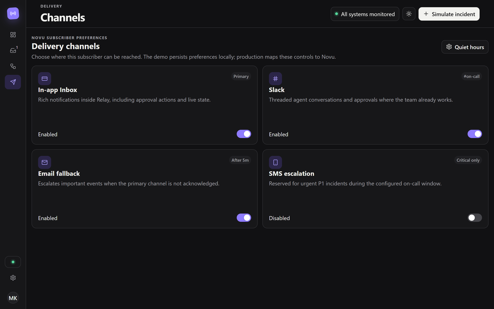 | 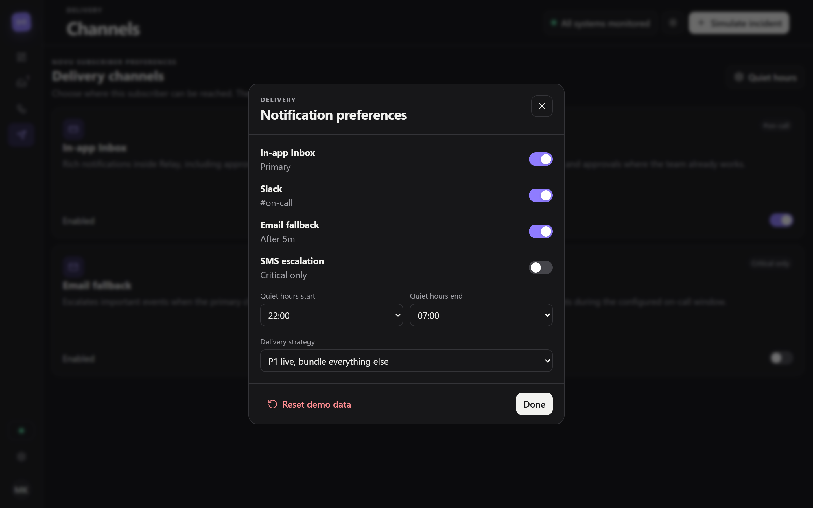 |

- **Multi-Channel Controls**: Toggle In-App Inbox, Slack `#on-call`, Email fallback, and SMS escalation independently.
- **Quiet Hours Scheduling**: Define quiet hours windows (e.g., `22:00` to `07:00`) where non-critical alerts are suppressed.
- **Delivery Strategy**: Configure digest aggregation (`P1 Live, Bundle rest`, `Deliver all immediately`, or `Scheduled digests only`).

---

## ⚡ Quickstart

### Prerequisites

- **Node.js** `18.0.0` or higher
- Modern Chromium-based browser (Chrome, Edge, Brave)

### 1. Clone and Install

```bash
git clone https://github.com/kh-bikash/novuagent.git
cd novuagent
npm install
```

### 2. Start the Server

```bash
npm start
```

Open your browser at **`http://127.0.0.1:4173`**.

> [!TIP]
> **Zero Configuration Required**: Relay runs out of the box in **Preview Mode** using browser-backed state. You can simulate incidents, chat with Atlas, approve mitigations, and toggle channels immediately!

---

## 🔌 Novu Integration & SDK Bridge

Relay includes a production-ready Novu backend adapter built on the official `@novu/api` SDK.

### Server-Side Trigger Implementation

When an incident occurs or its state changes, Relay dispatches structured workflow events via `@novu/api`:

```javascript
// server.mjs
import { Novu } from '@novu/api';

const novu = process.env.NOVU_SECRET_KEY
  ? new Novu({
      secretKey: process.env.NOVU_SECRET_KEY,
      serverURL: process.env.NOVU_API_URL || 'https://api.novu.co'
    })
  : null;

// Trigger workflow execution
await novu.trigger({
  workflowId: 'critical-incident',
  to: [{ subscriberId: 'on-call:maya' }],
  payload: {
    id: 1001,
    title: 'Checkout failures spiking',
    service: 'Payments API',
    severity: 'critical',
    summary: 'Error rate crossed 12% after deploy #8421.',
    recommendation: 'Roll back deploy #8421 to restore payment health.',
    facts: [
      'Impact: 184 failed checkouts',
      'Confidence: 96%',
      'Estimated recovery: 3 minutes'
    ],
    eventName: 'incident-created'
  },
  context: {
    app: 'relay',
    environment: process.env.NODE_ENV || 'development'
  }
});
```

### Workflow Event Mapping

| Relay Event Name | Default Novu Workflow ID | Trigger Condition | Notification Payload Action |
| :--- | :--- | :--- | :--- |
| `incident-created` | `critical-incident` | Incident simulated or detected | Dispatches initial multi-channel alert & Atlas recommendation |
| `incident-resolved` | `incident-resolved` | Human operator clicks **Approve** | Updates in-app card and Slack thread to *Resolved* |
| `incident-rejected` | `incident-action-rejected` | Human operator clicks **Reject** | Cancels automated action; preserves audit context |
| `incident-snoozed` | `incident-snoozed` | Human operator clicks **Snooze** | Silences notification for 30m unless severity escalates |

### Connecting a Live Novu Cloud or Self-Hosted Instance

Create a `.env` file in the project root (see [`.env.example`](.env.example)):

```ini
PORT=4173
HOST=0.0.0.0
NODE_ENV=production

# Novu Credentials
NOVU_SECRET_KEY=your_novu_api_secret_key_here
NOVU_API_URL=https://api.novu.co
NOVU_SUBSCRIBER_ID=on-call:maya

# Custom Workflow Identifiers (Optional)
NOVU_WORKFLOW_INCIDENT_CREATED=critical-incident
NOVU_WORKFLOW_INCIDENT_RESOLVED=incident-resolved
NOVU_WORKFLOW_INCIDENT_REJECTED=incident-action-rejected
NOVU_WORKFLOW_INCIDENT_SNOOZED=incident-snoozed
```

Restart Relay (`npm start`). The sidebar will automatically transition to **`Novu live (Workflow API connected)`**.

---

## 📡 API Reference

### Health Check

```http
GET /api/health
```

#### Response (`200 OK`)
```json
{
  "status": "ok",
  "novu": "live",
  "apiUrl": "https://api.novu.co"
}
```

---

### Dispatch Novu Event

```http
POST /api/novu/events
Content-Type: application/json
```

#### Request Body
```json
{
  "eventName": "incident-created",
  "payload": {
    "id": 1001,
    "title": "Checkout failures spiking",
    "service": "Payments API",
    "severity": "critical",
    "state": "action",
    "summary": "Error rate crossed 12% after deploy #8421.",
    "facts": [
      "Impact: 184 failed checkouts",
      "Confidence: 96%",
      "Estimated recovery: 3 minutes"
    ],
    "recommendation": "Deploy rollback recommended."
  }
}
```

#### Response (`202 Accepted`)
```json
{
  "mode": "live",
  "workflowId": "critical-incident",
  "subscriberId": "on-call:maya",
  "accepted": true
}
```

---

## ⌨️ Keyboard Shortcuts & UX Features

| Keybinding | Action |
| :--- | :--- |
| <kbd>/</kbd> | Instantly focus incident search input from any view |
| <kbd>Esc</kbd> | Close notification preferences modal |
| <kbd>Theme Toggle</kbd> | Toggle between Dark and Light mode (persisted to storage) |
| <kbd>Simulate incident</kbd> | Trigger randomized P1 incident across all channels |

---

## 🐳 Deployment

### Run with Docker

Relay includes a production-ready, multi-stage [`Dockerfile`](Dockerfile):

```bash
# Build Docker image
docker build -t relay .

# Run container with environment variables
docker run -d \
  -p 4173:4173 \
  --name relay-app \
  --env NOVU_SECRET_KEY=your_key_here \
  relay
```

### Production Node.js Hosting

Relay binds to `0.0.0.0` and respects standard `PORT` environment variables, making it compatible with Railway, Render, Fly.io, AWS ECS, Google Cloud Run, and Kubernetes.

```bash
PORT=8080 node server.mjs
```

---

## 🛠️ Developer Scripts

| Command | Description |
| :--- | :--- |
| `npm start` | Launches the Relay server on port `4173` |
| `npm run check` | Validates JavaScript syntax across all source code and scripts |
| `npm run demo:record` | Records a 60fps automated walkthrough video to `videos/` |

---

## 📂 Repository Structure

```
novu/
├── assets/                          # Product screenshots & visual assets
│   ├── atlas-agent-chat.png         # AI agent interactive inquiry screenshot
│   ├── delivery-channels.png        # Channel matrix configuration screenshot
│   ├── incident-inbox-dark.png      # Flagship incident triage (Dark Mode)
│   ├── incident-inbox-light.png     # Flagship incident triage (Light Mode)
│   ├── incident-resolved-state.png  # Multi-channel resolved state screenshot
│   ├── overview-dashboard.png       # Command center dashboard screenshot
│   ├── preferences-modal.png        # Quiet hours & delivery policy dialog
│   └── workflows-engine.png         # Novu workflow pipeline screenshot
├── scripts/                         # Automation & recording tooling
│   └── record-demo.mjs              # 60fps automated demo video recorder
├── videos/                          # Video artifacts
│   └── relay-real-workflow-demo.mp4 # Full end-to-end workflow video recording
├── app.js                           # Frontend client application & state machine
├── Dockerfile                       # Container deployment definition
├── index.html                       # Application shell & structural markup
├── LICENSE                          # MIT open-source license
├── package.json                     # Project dependencies and script commands
├── README.md                        # Comprehensive product documentation
├── server.mjs                       # Node.js static server & Novu SDK bridge
└── styles.css                       # Design system, themes & animations
```

---

## 📄 License

Relay is distributed under the [MIT License](LICENSE). Built to showcase what is possible with [Novu](https://novu.co).
